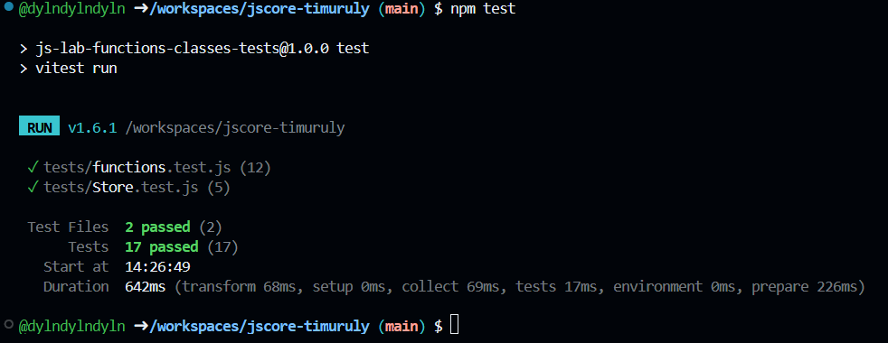

JavaScript: Functions, Closures, Classes & Unit Tests

This repository contains implementations of standard JS utility functions using higher-order functions, class inheritance with private fields, and unit testing via Vitest.

How to run the tests

1. Install dependencies:
   ```bash
   npm i

    Run tests:
    Bash

    npm test

Closures in my code

In my code, closures are explicitly used in the memoize and counter functions.

When memoize(fn) is executed, it creates a local variable cache via new Map() and returns an inner anonymous function. This returned function retains access to cache even after memoize has finished execution. Each time the returned function is invoked, it reads from and writes to this lexical environment.

Similarly, in counter(initialValue), the internal variable count is retained in memory because the returned object methods (inc, dec, value) hold a reference to it. This provides true data encapsulation, making count inaccessible directly from the outside scope.
AI Tools Usage

During the development of this repository, the following AI assistance tools were used: Gemini

Screenshot of Passing Tests


